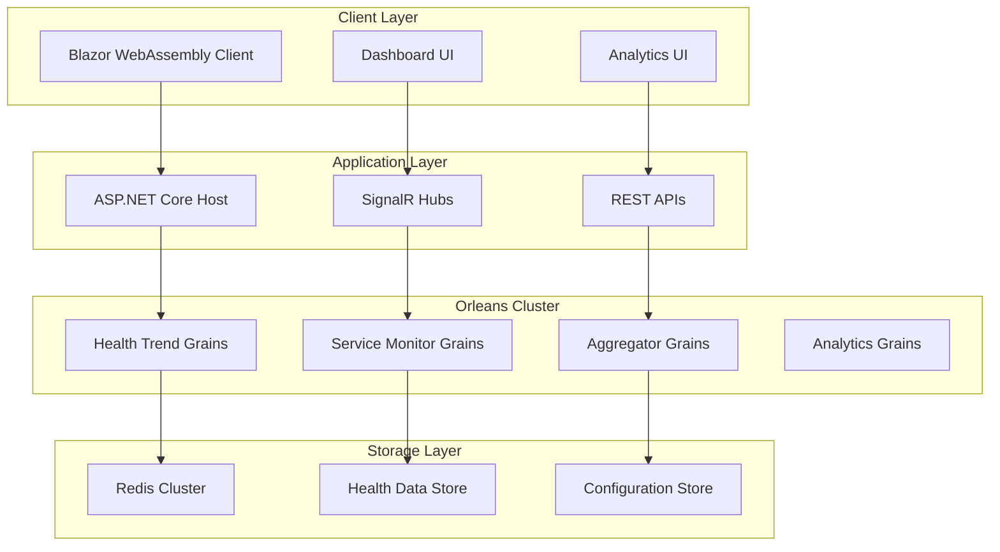

# Health Monitor Architecture

This document provides a comprehensive overview of the Health Monitor Orleans system architecture, covering both the backend distributed systems architecture and the recently refactored frontend design.

## 🏗️ System Overview

The Health Monitor Orleans is a distributed, actor-based health monitoring system that provides real-time monitoring capabilities with sophisticated analytics. The system follows a microservices architecture pattern using Microsoft Orleans for distributed computing.



## 🎯 Core Components

### 1. Blazor WebAssembly Client (`HealthMonitor.Client`)

**Recent Refactoring**: The client has been elegantly restructured to separate concerns between monitoring and analytics.

#### Dashboard (Real-time Monitoring)
- **Location**: `Pages/Dashboard.razor`
- **Purpose**: Real-time system overview and monitoring
- **Key Features**:
  - Live system health metrics
  - Service status indicators
  - Critical alerts display
  - Quick action buttons
  - Auto-refresh capabilities

#### Analytics Section (Detailed Analysis)
- **Location**: `Pages/AnalyticsOverview.razor` and `Pages/Analytics/`
- **Purpose**: Comprehensive data analysis and insights
- **Pages**:
  - **Trends** (`Analytics/Trends.razor`) - Historical performance patterns
  - **Insights** (`Analytics/Insights.razor`) - Anomaly detection and predictions
  - **SLA** (`Analytics/SLA.razor`) - Service level agreement tracking
  - **Services** (`Analytics/Services.razor`) - Individual service deep-dive

#### Shared Components
```
Components/
├── AnalyticsLayout.razor       # Common analytics page layout
├── ServiceFilterSidebar.razor  # Service filtering UI
├── HealthTrendChart.razor      # ApexCharts integration
├── AnomalyDetectionPanel.razor # Anomaly visualization
├── SlaCompliancePanel.razor    # SLA metrics display
├── PredictionsPanel.razor      # Predictive analytics
└── ServiceRankingList.razor    # Service performance ranking
```

### 2. ASP.NET Core Host (`HealthMonitor`)

**Responsibilities**:
- Hosting Blazor WebAssembly client
- Orleans silo hosting
- SignalR hub management
- API endpoint provision
- Configuration management

**Key Services**:
```csharp
// Program.cs configuration
builder.Services.AddRazorComponents()
    .AddInteractiveServerComponents()
    .AddInteractiveWebAssemblyComponents();

builder.Services.AddMudServices();
builder.UseOrleansClient();
builder.AddKeyedRedisClient("orleans-redis");
```

### 3. Orleans Cluster (`HealthMonitor.Cluster`)

The Orleans cluster provides the distributed computing backbone with specialized grain actors.

#### Health Trend Grains
```csharp
public interface IHealthTrendGrain : IGrainWithStringKey
{
    Task<HealthTrendData> GetCurrentTrendAsync();
    Task UpdateHealthMetricsAsync(HealthMetrics metrics);
    Task<List<HealthTrendData>> GetHistoryAsync(int hours);
}
```

#### Health Trend Aggregator Grains
```csharp
public interface IHealthTrendAggregatorGrain : IGrainWithStringKey
{
    Task<ServiceComparison> CompareServicesAsync(List<string> serviceIds, int hours);
    Task<SystemHealthOverview> GetSystemOverviewAsync();
}
```

#### Key Services
- **HealthTrendCalculator** - Calculates health scores and trends
- **Anomaly Detection** - Identifies unusual patterns
- **SLA Monitoring** - Tracks service level agreements

### 4. Data Models (`HealthMonitor.Model`)

#### Core Health Models
```csharp
public class HealthTrendData
{
    public string ServiceId { get; set; }
    public DateTime CalculatedAt { get; set; }
    public double OverallHealthScore { get; set; }
    public double AvailabilityPercentage { get; set; }
    public TimeSpan AverageResponseTime { get; set; }
    public HealthTrend HealthTrend { get; set; }
    public List<DetectedAnomaly> DetectedAnomalies { get; set; }
    public List<HealthPrediction> Predictions { get; set; }
    public SlaMetrics SlaMetrics { get; set; }
}
```

#### Analytics Models
```csharp
public class ServiceComparison
{
    public DateTime GeneratedAt { get; set; }
    public List<ServiceComparisonItem> ServiceComparisons { get; set; }
}

public class SystemHealthOverview
{
    public double OverallSystemHealth { get; set; }
    public int TotalServices { get; set; }
    public int HealthyServices { get; set; }
    public List<SystemAlert> Alerts { get; set; }
}
```

## 🔄 Data Flow Architecture

### 1. Health Data Collection
```
External Services → Health Checks → Orleans Grains → Redis Storage
```

### 2. Real-time Updates (Dashboard)
```
Orleans Grains → SignalR Hub → Blazor Client → Dashboard UI
```

### 3. Analytics Processing (Analytics Section)
```
Historical Data → Trend Calculation → Anomaly Detection → Analytics UI
```

### 4. User Interactions
```
User Action → Blazor Component → HTTP/SignalR → Orleans Grain → Data Processing
```

## 🚀 UI Architecture (Post-Refactoring)

### Navigation Flow
```
Dashboard (/)
    ├── Real-time monitoring
    ├── System overview
    └── Quick Actions
        └── View Analytics → Analytics Hub (/analytics)
                              ├── Trends Analysis (/analytics/trends)
                              ├── Advanced Insights (/analytics/insights)
                              ├── SLA Compliance (/analytics/sla)
                              └── Service Deep-dive (/analytics/services)
```

### Component Hierarchy
```
MainLayout.razor
├── NavMenu.razor (Navigation)
├── Dashboard.razor (Overview)
│   ├── System Health Cards
│   ├── Alerts Panel
│   ├── Service Rankings
│   └── Quick Health Trend
└── AnalyticsLayout.razor (Analytics)
    ├── Breadcrumb Navigation
    ├── Service Filters
    ├── Time Range Controls
    └── Analytics Components
        ├── HealthTrendChart
        ├── AnomalyDetectionPanel
        ├── SlaCompliancePanel
        └── PredictionsPanel
```

## 🔧 Technology Integration

### MudBlazor Integration
- **Material Design** components throughout the UI
- **Responsive layout** with grid system
- **Theme support** for consistent styling
- **Form validation** and user interactions

### ApexCharts Integration
- **Interactive charts** for trend visualization
- **Real-time updates** for live data display
- **Export capabilities** for data analysis
- **Responsive design** for mobile compatibility

### Redis Integration
- **Orleans clustering** for grain directory
- **State persistence** for grain storage
- **Caching layer** for improved performance
- **Pub/Sub messaging** for real-time updates

## 📊 Performance Characteristics

### Scalability
- **Horizontal scaling** through Orleans silo clustering
- **Load distribution** via grain activation management
- **Auto-scaling** based on system load

### Reliability
- **Fault tolerance** through Orleans actor model
- **Data persistence** with Redis clustering
- **Circuit breaker patterns** for external service calls

### Performance
- **WebAssembly** for client-side performance
- **SignalR** for real-time updates
- **Efficient caching** strategies
- **Optimized grain lifecycle** management

## 🔒 Security Considerations

### Client Security
- **WebAssembly sandboxing** for client-side security
- **HTTPS enforcement** for data transmission
- **Input validation** on all user inputs

### Orleans Security
- **Grain isolation** for multi-tenancy
- **Secure clustering** with Redis authentication
- **API authentication** for external access

## 🚀 Deployment Architecture

### Single Node Deployment
```
Docker Container
├── ASP.NET Core Host
├── Blazor WebAssembly Client
├── Orleans Silo
└── Redis Instance
```

### Clustered Deployment
```
Load Balancer
├── Web Server 1 (Host + Client)
├── Web Server 2 (Host + Client)
├── Orleans Silo Cluster
│   ├── Silo 1 (Health Grains)
│   ├── Silo 2 (Analytics Grains)
│   └── Silo 3 (Aggregator Grains)
└── Redis Cluster
    ├── Master Node
    ├── Replica Node 1
    └── Replica Node 2
```

## 🔮 Future Architecture Considerations

### Planned Enhancements
- **Microservice decomposition** of grain types
- **Event sourcing** for audit trails
- **CQRS patterns** for read/write separation
- **Machine learning** integration for advanced predictions

### Monitoring & Observability
- **Distributed tracing** with OpenTelemetry
- **Metrics collection** with Prometheus
- **Log aggregation** with structured logging
- **Health check endpoints** for service monitoring

This architecture provides a solid foundation for a scalable, maintainable, and user-friendly health monitoring system with clear separation between real-time monitoring and detailed analytics capabilities.